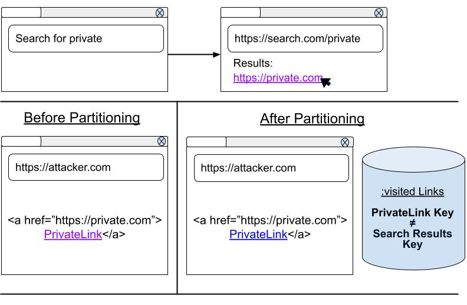

# Explainer: Partitioning :visited links history

## Author:
[Kyra Seevers](https://github.com/kyraseevers)

## Participate:
- [Issue Tracker](TODO)
- [Discussion Forum](TODO)

## Table of Contents:
- [Introduction](#introduction)
  - [Motivation](#motivation)
  - [Goals](#goals)
  - [Non-Goals](#non-goals)
  - [Prior Art](#prior-art)
- [General API Approach](#general-api-approach)
  - [Key Scenarios](#key-scenarios)
  - [Additional Design Principles](#additional-design-principles)
- [Security and Privacy](#security-and-privacy)
- [Future Work](#future-work)
- [Alternatives Considered](#alternatives-considered)
- [References and Acknowledgements](#references-and-acknowledgements)

## Introduction:
Browsers keep track of the pages that a user has visited, and they use this information to style anchor elements on a page differently if a user has visited that link before. Most browsers give visited links a different color by default; some web developers rely on the [:visited CSS selector](https://drafts.csswg.org/css2/#selectordef-visited) to style visited links according to their own preferences. 

It is well-known that styling visited links differently from unvisited links opens the door to [side-channel attacks that leak the user’s browsing history](https://www.usenix.org/system/files/conference/woot18/woot18-paper-smith.pdf?ref=https://githubhelp.com). One [notable attack](https://blog.mozilla.org/security/2010/03/31/plugging-the-css-history-leak/) used `window.getComputedStyle` and the methods that return a NodeList of HTMLCollection of anchor elements (e.g. `document.querySelectorAll`, `document.getElementsByTagName`, etc.) to inspect the styles of each link that was rendered on the page. Once attackers had the style of each link, it was possible to determine whether each link had been visited, leaking sensitive information that should have only been known to the user.

In 2010, [browsers implemented a mitigation](https://developer.mozilla.org/en-US/docs/Web/CSS/Privacy_and_the_:visited_selector) for this attack: (1) when sites queried link styling, the browser always returned the “unvisited” style, and (2) developers were now limited in what styles could be applied to links. However, these mitigations were complicated for both browsers to implement and web developers to adjust to, and there are proponents of removing these mitigations altogether.

## Motivation:
Since 2010, the number of side-channel attacks to leak the user’s browsing history from :visited links styling has grown, including user interaction attacks, timing attacks, pixel color attacks, and process-level attacks [\[1\]](TODO LINK REFERENCE 1). While these attack vectors are slowed down by the [2010 mitigations](https://developer.mozilla.org/en-US/docs/Web/CSS/Privacy_and_the_:visited_selector), they are not eliminated; browsers are still actively leaking user browsing history today.

Until browsers remove the visible differences between visited and unvisited links on a user’s screen, or the information provided to attackers via these side-channel attacks is no longer valuable, browsers have no robust defense against attackers who want to obtain information about a user’s private browsing history.

## Goals:
- Improve user privacy by eliminating :visited links history leaks.
- Ensure the information available via side-channel attacks on :visited links is no longer valuable or net-new to attackers. 
- Prevent browser history from being used as a cross-site tracking vector.
- Avoid browser performance regressions by keeping common actions, like :visited links memory management and lookup, highly performant.
- Avoid losing user browsing history where possible (i.e. make efforts to retain and/or replenish unpartitioned visited links that would be lost in a partitioned table).

## Non-Goals:
- This document does not deprecate the :visited links selector. It merely limits which links may be colored as visited on the page.
- This document does not propose solutions to prevent leaking browsing history through process-level attacks or renderer compromises. This is covered in the Future Work section below.
- This document does not propose methods to reduce complexity in CSS parsing related to the 2010 mitigations. This is covered in the Future Work section below.

## General API Approach:
To meet our stated goals, we propose partitioning :visited links history. For the purpose of this document, partitioning is defined as storing visited links history via partition key, rather than just by the link URL. When a renderer queries the stored visited links, only queries that match all the elements of the partition key may be colored as visited on the page. On the user’s end, this will mean that the browser styles links as :visited if and only if they have been visited from this site and frame before.

Our partition key will be “triple-keyed” or store three pieces of information: the link’s URL, the top-level site, and the origin of the frame where the link is rendered.

1. The renderer determines the partition key for each link on the page.
2. The renderer asks if the partition keys are stored in :visited Links.
3. If :visited Links contains an entry matching all parts of the partition key, it allows the renderer to color the link as visited.

## Prior Art:
There have been many proposals to reduce the amount of user browsing history leaked by :visited links. Proposals written before 2011 are well summarized by Weinberg et. al. in Section IV: “F. Discussion” of [I Still Know What You Visited Last Summer: Leaking Browsing History via User Interaction and Side Channel Attacks.](https://ieeexplore.ieee.org/document/5958027)

#### “Domain Tagging” and “Same-Origin Bounding”
One potential solution is for browsers to style links as :visited if and only if they are same-domain, same-site, or same-origin with the current page. 

Russell (2015) proposes that same-origin boundedness will render side channel attacks obsolete: “if a user has visited a site before … the server's logs could already identify which URLs at the origin they've navigated to. This means there's no reason to prevent exposing which same-origin URLs are visited” [\[2\]](TODO LINK REFERENCE 2). Clover (2002) suggested this solution is infeasible due to its “severe blow to the functionality and usability expected of visited links” [\[3\]](TODO LINK REFERENCE 3). However, Russell asserts that user expectations regarding visited links are not well understood [\[2\]](TODO LINK REFERENCE 2).

Ultimately, this potential solution did not align with our goal to “avoid losing user browsing history where possible.” Users would lose a significant amount of their global visited link history, as sites often contain cross-site links. However, we felt that limiting which links could be safely styled as visited was a step in the right direction. Our proposed solution is similar to Russell’s 2015 “Same-origin + Path-visited (aka: "Knowably Visited")”, which also styles links “which could have been previously discovered through logging (forward via clicks, or backward via referrer)” [\[2\]](TODO LINK REFERENCE 2). This potential solution preserved much more of the user’s existing browsing history.

#### “SafeHistory”
Another potential solution is for browsers to style links as :visited if and only if they are same-domain with the current page, have been previously visited from this site, or are on a custom allowlist.

Proposed by Jackson et. al. in 2006, this solution is still vulnerable to pixel color and user-interaction attacks, due to the inclusion of allowlist links that are not same-domain or previously visited from this site [\[4\]](TODO LINK REFERENCE 4)[\[2\]](TODO LINK REFERENCE 2). Weinberg et. al. (2011) claim this solution “sacrifices what is arguably the most useful case of visited-link indications (when a new-to-the-user site links to a document they have already seen)” [\[5\]](TODO LINK REFERENCE 5). However, once again, according to Russell, user expectations regarding visited links are not well understood [\[2\]](TODO LINK REFERENCE 2). We suspect that, as the web ecosystem has evolved, users have come to associate visited links with those they have clicked on this page before, rather than a site they may have visited from any context in the past.

Ultimately, this potential solution did not align with our goal to “improve user privacy by reducing the amount of history leaked by :visited links.” We felt the addition of an allowlist enabled significant privacy leaks. However, we felt that limiting :visited link styling to links previously visited from this site was a concept we wanted to build on for our proposed solution.

## Key Scenarios:

### Scenario #1: Partitioning Protects Against User-Interaction, Timing, and Pixel Color Attacks

<figure>
    
     
<em>A user searches for private.com and clicks on the https://private.com link from the https://search.com/private results page. Before partitioning, this meant that any site, for example https://attacker.com, that embedded https://private.com as a link element could see if a user had visited it from the search results before. After partitioning, the links on https://attacker.com and https://search.com/private have different partition keys, as they have different frame origins and top-level sites. So the partitioned link is not colored - no longer leaking history to https://attacker.com.</em>
      
</figure>

Attackers employ user-interaction, timing, and pixel color side-channel exploits to gain the user’s browsing history. Currently, a styled :visited link reveals that a user has visited that site anywhere on the web (from a click on a third-party site, from a bookmark, from typing it into the omnibox). This is information that https://attacker.com does not already have. However, sites that embed link elements can already determine when a user clicks on a link, and what is embedded in that link. So by partitioning :visited links and limiting coloring to links clicked from this site and frame before, we are not leaking any history that an https://attacker.com does not already know.

As a result, partitioning :visited links eliminates its value to attackers, while maintaining the navigational benefits for users. 

### Scenario #2: Triple-Key Partitioning Protects Against Cross-Site Tracking

<figure>
    
     
<em>A user clicks “Lorem-Iframe Link.” Even though both frames display the same origin and have a link to https://link.example, only the “Lorem-Iframe Link” is styled as visited, as they have different top-level sites.</em>
      
</figure>

The top-level site in a triple-key partition keeps history confined to the top-level site it was clicked on and prevents cross-site tracking. Otherwise documents from https://www.foo.com embedded by different top-level sites will have access to the same :visited link history, effectively creating an equivalent to the third-party cookie.

### Scenario #3: Triple-Key Partitioning Protects Against Mainframe History Leaks

<figure>
    
     
<em>A user clicks “Mainframe Link.” Even though both frames have a link to 
https://link.example, only the mainframe link is colored as visited, as they have different 
frame origins.</em>
      
</figure>

The frame origin in a triple-key partition keeps history confined to the frame it is visited in. Otherwise, any content embedded in a site can determine the history of its embedder; this leak of information would be inconsistent with the same-origin policy which ensures that cross-site iframes don't get access to the state of their embedder, and vice versa.

## Additional Design Principles
#### Clicks vs. Other Navigations
In our proposed design, :visited links history would only contain user browsing history initiated from link clicks. All other navigations (e.g. typing a site into the address bar, navigating to a site from your favorites, etc.) would not be recorded in the :visited links database. All other navigation types cannot be properly attributed to a partition (as they have no top-level site or frame origin). As a result, including these sites in the database, unpartitioned or with a “best-guess” partition, would leak information.

#### Storing Partitioned Keys Before Launch
To ensure that the transition between unpartitioned and partitioned :visited links history is as smooth as possible for users, we intend to spend a period of time before launch storing newly visited links as both partitioned and unpartitioned in the database. While this temporarily increases the size of the database, it also ensures that the browser can store complete information about recently visited links before the feature launches.

## Security and Privacy
The goal of this proposed solution is to improve user privacy by reducing the amount of history leaked by :visited links and rendering the information gained by side-channel attacks obsolete. 

Our partition key design enforces a strong privacy boundary:
`Link URL`: the resource itself we are styling.
`Top-Level Site`: the site of the top/main frame.
prevents cross-site tracking.
`Frame Origin`: the origin of the frame where the anchor element is displayed.
prevents embedders from leaking history into embedded content and vice versa.
prevents history leaks across subdomains with different security postures.

## Future Work
#### Preventing Leaks From Renderer Compromises
For browsers that store :visited links in the renderer, process-level attacks like SpectreJS still have the potential to leak user browsing history in the event of a renderer compromise. As future work, we could partition the memory stored in each process to eliminate this particular leak vector.

#### Deprecating the 2010 CSS Mitigations
The proposed API in this explainer would improve user privacy against side-channel attacks, including those covered by the 2010 mitigations. As future work, we could deprecate the 2010 mitigations, reducing the complexity of CSS for both browsers and web developers.

## Alternatives Considered
#### Deprecate the :visited selector 
The most obvious method of eliminating :visited history leaks is to get rid of :visited link styling entirely. As long as sites can style :link and :visited differently, there is some information about user browsing history available to side-channel attackers. 

However, we chose not to deprecate the :visited selector because we believe it provides users with useful visual cues as they navigate around the web. Our goal is to improve users’ privacy while also preserving the navigational benefits that :visited links styling provides in information-rich or link-dense environments [\[6\]](TODO LINK REFERENCE 6). 

In our proposed solution, we take advantage of the fact that sites can easily record which of its own anchor elements a user has visited. Our partitioning method only styles links that have been visited from this site and frame before. Therefore, our partitioning method only provides information that the site already knows. This renders any side-channel attacks obsolete, and allows us to maintain :visited links styling without revealing any additional browsing history to attackers.

#### Allow sites with permissions to style :visited links
One potential method of reducing privacy leaks is to give users control over when their information is shared. One solution would be to allow sites who ask for user permission to style :visited links.

However, this solution is highly susceptible to fraud. Sites interested in user browsing history can aggressively push users to accept their permissions, causing many users to give up privacy to reduce the annoyance. Additionally, permissions could incentivize sites to add unnecessary redirects through valuable URLs just to gain browsing history for that user and communicate that information to its other contexts.

Since this potential for fraud does not align with our goal to make side-channel attacks no longer valuable, we decided against a permissions-based approach.

#### Only style same-origin :visited links
This solution did not align with our goal to “avoid losing user browsing history where possible.” For more detail, see [“Domain Tagging” and “Same-Origin Bounding”](#domain-tagging-and-same-origin-bounding) in the Prior Art section.

## References and Acknowledgements
#### Acknowledgements
Thanks to Artur Janc, Mike Taylor, and Brianna Goldstein for their advice, expertise, and design thinking that contributed greatly to this proposal.
#### Citations
[1] A list of side-channel attacks employed to leak a user’s browsing history, grouped by type:
  #### User Interaction Attacks
  - <em>Weinberg et al, S&P 2011: [I still know what you visited last summer](https://ieeexplore.ieee.org/abstract/document/5958027)
  - Michal Zalewski, 2013: ["Asteroids" game](https://lcamtuf.coredump.cx/yahh/)
  - Michal Zalewski, 2016: [mix-blend-mode whack-a-mole](https://lcamtuf.blogspot.com/2016/08/css-mix-blend-mode-is-bad-for-keeping.html)
  - Ron Masas, 2021: [The human side channel](https://ronmasas.com/posts/the-human-side-channel)</em>

  #### Timing Attacks
  - <em>Paul Stone, BlackHat 2013: [Pixel Perfect Timing Attacks with HTML5](https://owasp.org/www-pdf-archive//HackPra_Allstars-Browser_Timing_Attacks_-_Paul_Stone.pdf)
  - NDevTK: [Detecting Visited Links via Redraw Timing](https://ndev.tk/visted/)
  - Michael Smith et al, [USENIX WOOT 2018: Browser history re:visited](https://www.usenix.org/sites/default/files/conference/protected-files/woot18_slides_smith.pdf)
  - Known WONTFIX bugs: [crbug.com/252165](http://crbug.com/252165), [crbug.com/835590](http://crbug.com/835590) </em>

  #### Pixel Color Attacks
  - <em>Łukasz Olejnik, 2017: [Stealing sensitive browser data with the W3C Ambient Light Sensor API](https://blog.lukaszolejnik.com/stealing-sensitive-browser-data-with-the-w3c-ambient-light-sensor-api/)
  - Artur Janc: [Cross-origin data leaks via the ambient light sensor](http://arturjanc.com/ls/) 
  - Artur Janc: [True Colors](http://arturjanc.com/eyedropper/)</em>

  #### Process-Level Attacks
  - <em>Leaking the contents of compromised renderer memory with [SpectreJS](https://chromium.googlesource.com/chromium/src/+/refs/heads/main/docs/security/side-channel-threat-model.md)</em>

[2] <em>Alex Russell, 2015: [Rethinking :visited-ness](https://docs.google.com/document/d/1Rnq4qZvXiuaO6KSugrXM6M7dVOpRsuOVxZBeobqeN7w/edit)</em>
[3] <em>Andrew Clover, 2002: [CSS visited pages disclosure](https://seclists.org/bugtraq/2002/Feb/271)</em>
[4] <em>Jackson et. al., 2006: [Protecting Browser State from Web Privacy Attacks](https://crypto.stanford.edu/sameorigin/sameorigin.pdf)</em>
[5] <em>Weinberg et al, S&P 2011: [I still know what you visited last summer](https://ieeexplore.ieee.org/abstract/document/5958027)</em>
[6] <em>Jakob Nielsen, 2004: [Change the Color of Visited Links](https://www.nngroup.com/articles/change-the-color-of-visited-links/)</em>

#### References
- [CSS 2 Section 5.11.2. The link pseudo-classes: :link and :visited](https://drafts.csswg.org/css2/#link-pseudo-classes)
- [USENIX WOOT 2018: Browser history re:visited](https://www.usenix.org/sites/default/files/conference/protected-files/woot18_slides_smith.pdf)
- [Preventing attacks on a user's history through CSS :visited selectors](https://dbaron.org/mozilla/visited-privacy)
- [Privacy and the :visited selector](https://developer.mozilla.org/en-US/docs/Web/CSS/Privacy_and_the_:visited_selector)
- [I Still Know What You Visited Last Summer: Leaking Browsing History via User Interaction and Side Channel Attacks.](https://ieeexplore.ieee.org/abstract/document/5958027)
